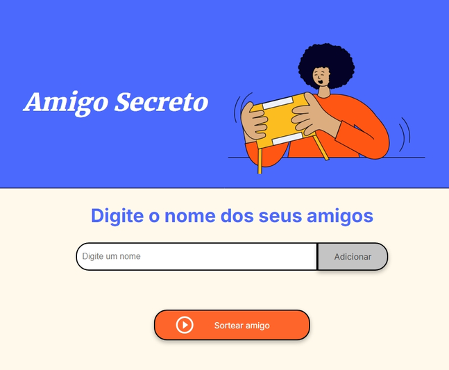
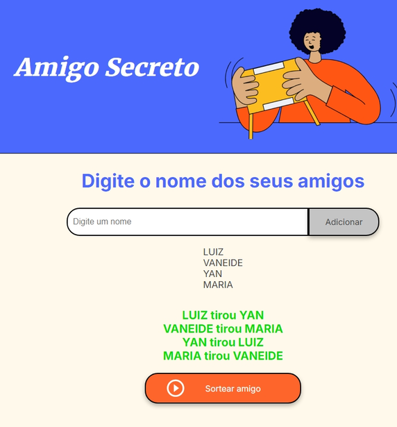

# Amigo Secreto

## 📝 Descrição do Projeto

Este é um jogo de Amigo Secreto desenvolvido em HTML, CSS e JavaScript. O projeto permite que os usuários adicionem nomes de amigos e realizem um sorteio para determinar quem será o amigo secreto de cada um.

## 🚀 Tecnologias Utilizadas

As seguintes tecnologias foram utilizadas no desenvolvimento deste projeto:

- 
- 
- 

## 🎯 Funcionalidades

- Adicionar nomes de amigos.
- Exibir a lista de amigos adicionados.
- Sortear o amigo secreto e exibir o resultado.

## 📸 Screenshot

## 💡 Apresentação

O jogo de Amigo Secreto é perfeito para realizar sorteios de maneira fácil e divertida com amigos e familiares. A interface intuitiva permite adicionar participantes e sortear os amigos secretos com apenas um clique. Tudo isso com um design moderno e amigável.

## 🧑‍💻 Autor

Este projeto foi desenvolvido por [Luiz Felipe](https://github.com/ssluiz). Sinta-se à vontade para explorar e contribuir!

## 📄 Licença

Este projeto está sob a licença MIT. Veja o arquivo [LICENSE](https://github.com/ssluiz/Plataforma-Alura/blob/main/Projetos/Jogo%20do%20Amigo%20Secreto/LICENCE.md) para mais detalhes.

